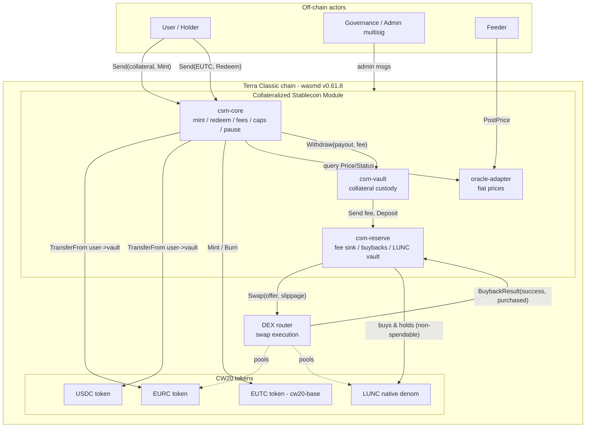
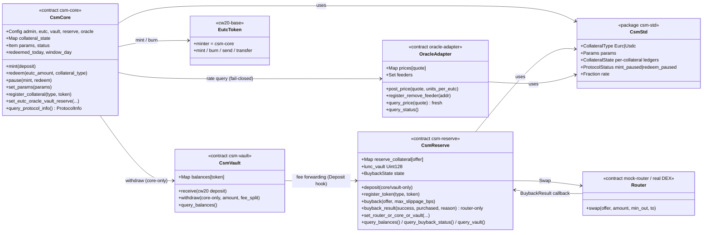
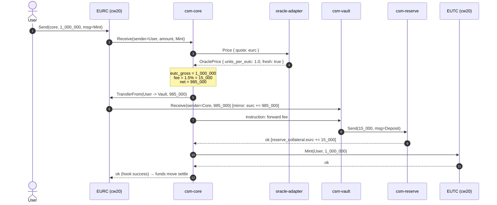
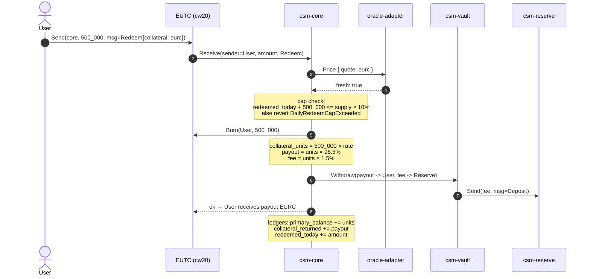
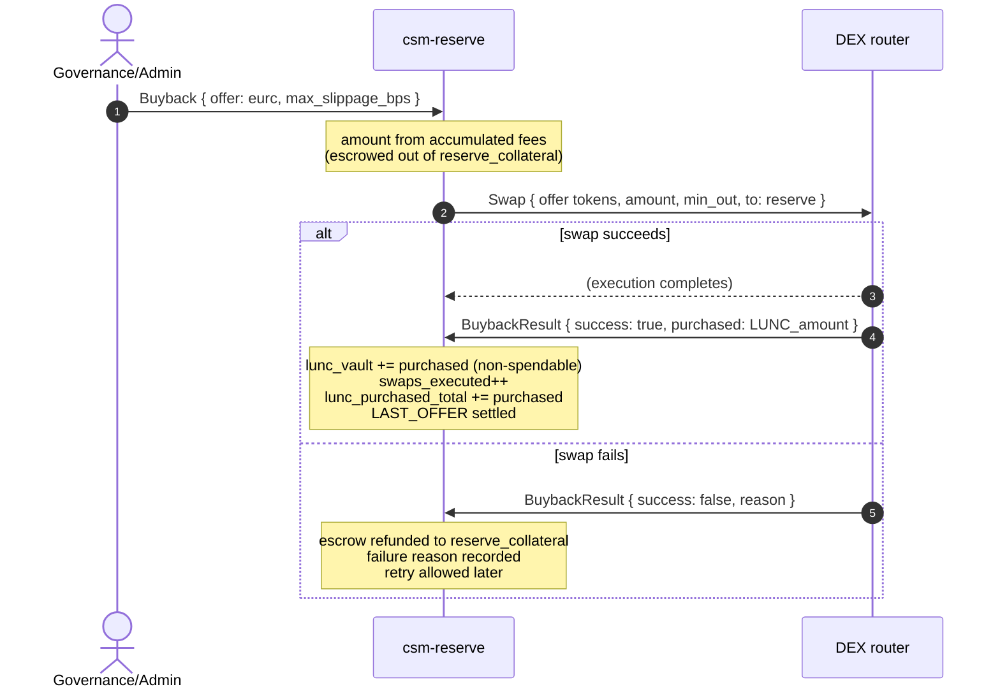
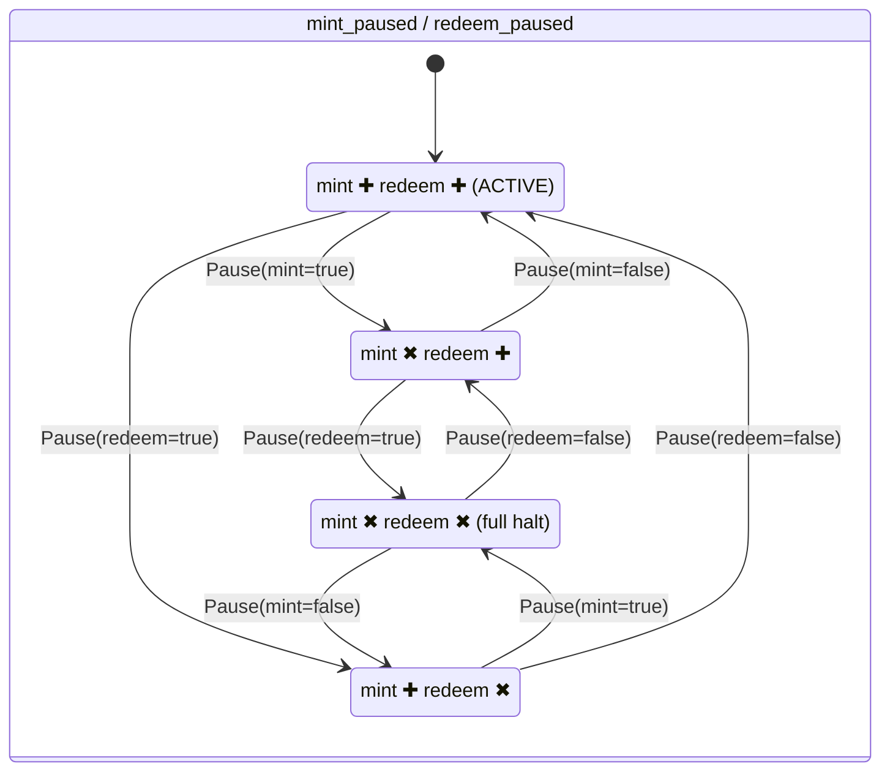
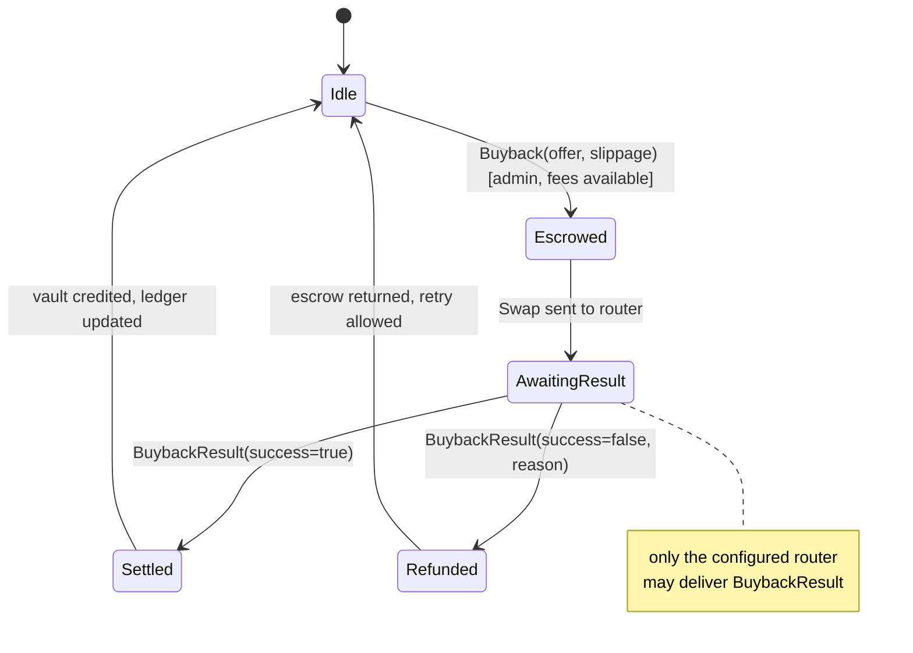
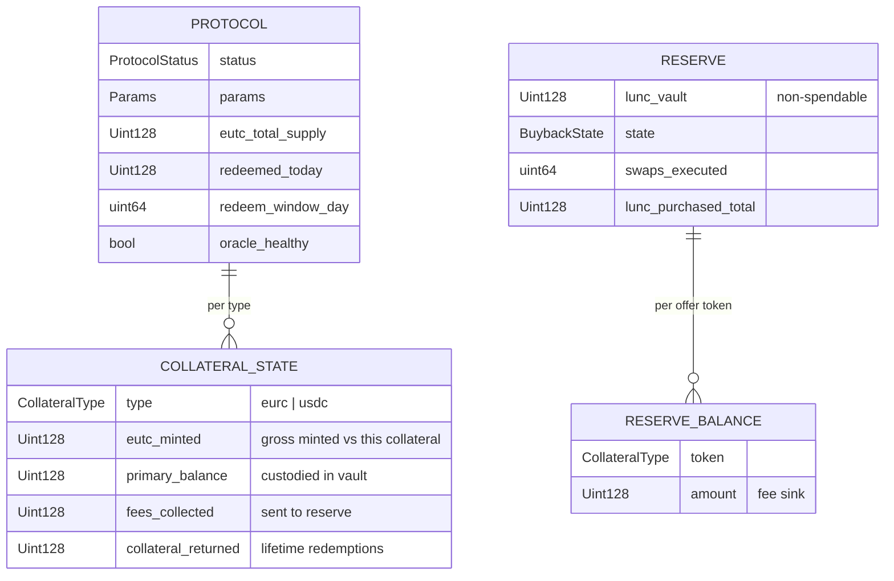

# EUTC / CSM — UML & Flow Diagrams (Mermaid)

All diagrams are [Mermaid](https://mermaid.js.org/) and render on GitHub. Companion docs: [SPEC.md](./SPEC.md) · [ARCHITECTURE.md](./ARCHITECTURE.md).

---

## 1. Component map (deployment view)

## 2. Class diagram (contracts, state, key operations)

## 3. Sequence — Mint (EURC example)

## 4. Sequence — Redeem (cap check → burn → payout + fee)

## 5. Sequence — LUNC buyback (escrow → router → settle/refund)

## 6. State machine — protocol gates (orthogonal)

Mint and redeem pause **independently** (`Pause { mint, redeem }`); the four combinations are legal states.

## 7. State machine — buyback lifecycle

## 8. Data model (accounting layer per collateral)

> Reading guide: solvency (SPEC I1) is `Σ primary_balance ≥ Σ eutc_minted` at last-used rates; fee conservation (I3) is `Σ fees_collected == Σ reserve_balance` per token.
